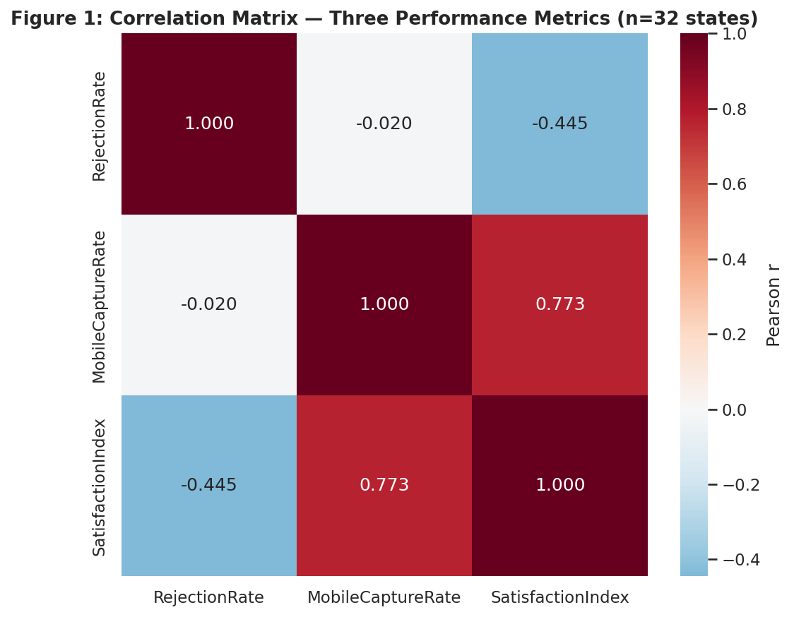
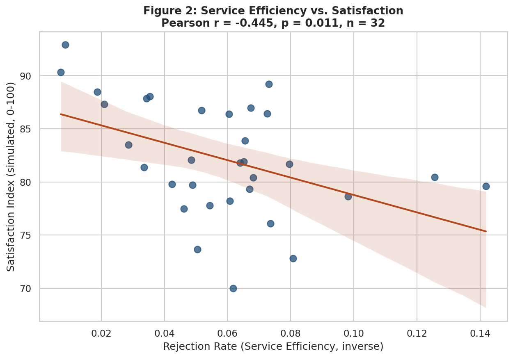
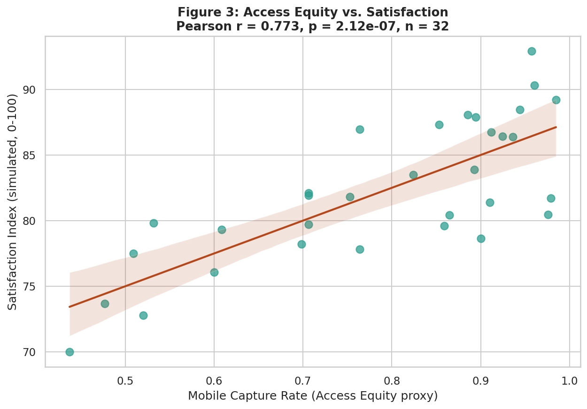
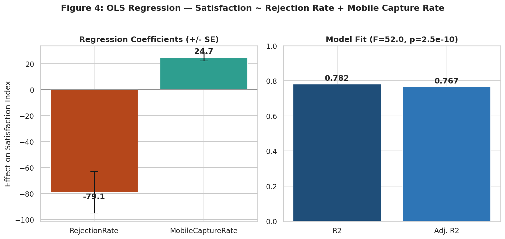
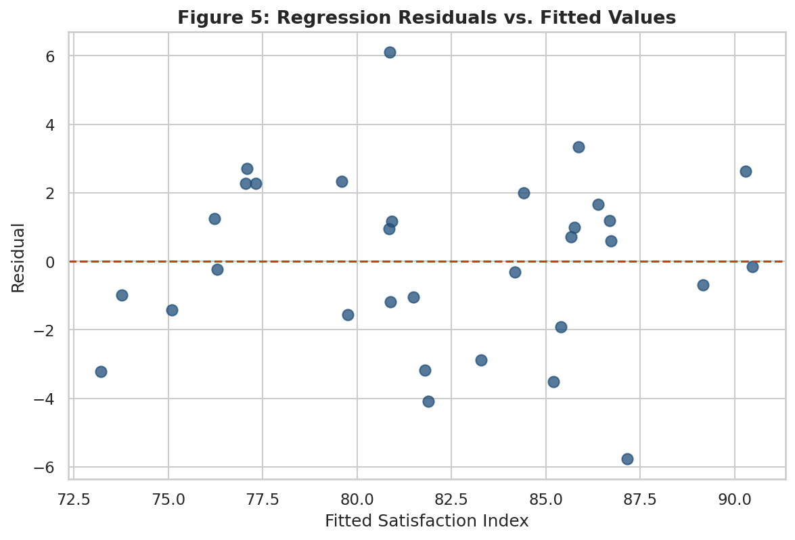
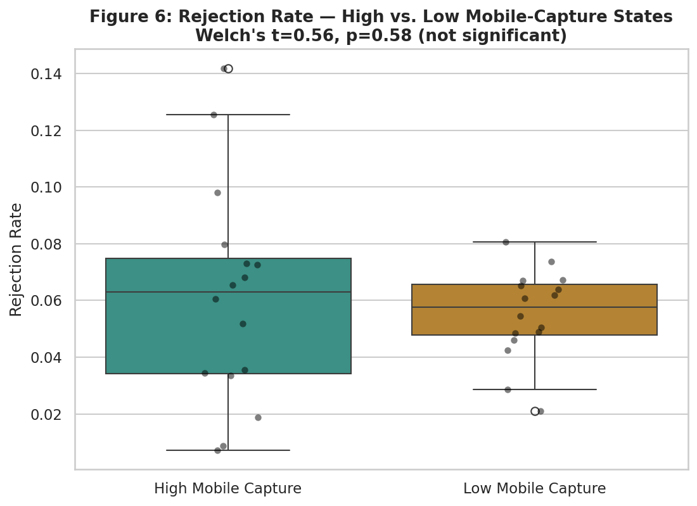

<div align="center">

# 📐 E-Governance Performance: A Statistical Analysis
### Efficiency, Equity, and Satisfaction — Tested, Not Assumed

*Does better digital access actually make citizens happier with government services — or does reducing friction matter more? Let's test it.*


**[📓 Notebook](notebooks/04_statistical_analysis_egovernance.ipynb) · [📊 Live Dashboard](dashboard/statistical_dashboard.html) · [📄 Full Report](docs/Week4_Statistical_Analysis.docx)**

</div>

---

## ✨ What is this project?

A statistical validation of the relationships between three e-governance performance
dimensions — **Service Efficiency**, **Access Equity**, and **User Satisfaction** — using
**Pearson correlation**, **multiple linear regression (OLS)**, and a bonus **independent-samples
t-test**, applied across 32 Indian states/UTs.

This project deliberately combines **two different real public resources** rather than
stretching one dataset to cover everything:

| Resource | Role |
|---|---|
| **UIDAI Aadhaar enrollment records** (Govt. of India, NDSAP) | Real, measured Service Efficiency & Access Equity metrics |
| **DigiLocker's Google Play Store rating** (4.1/5, 628,153 reviews) | Real, cited anchor point for the simulated Satisfaction Index |

> 🔍 **No real state-wise citizen satisfaction dataset exists publicly** — so rather than fake
> one silently, this project **simulates it transparently**: a documented formula, explicit
> assumptions, a fixed random seed for full reproducibility, and an honest limitations section
> that says exactly what the resulting numbers can and cannot prove.

## 📊 The Three Metrics

| # | Metric | What It Measures | Data Type |
|---|---|---|:---:|
| 1 | **Service Efficiency** | Aadhaar enrollment rejection rate per state | Real |
| 2 | **Access Equity** | Mobile-number capture rate per state | Real |
| 3 | **User Satisfaction** | Simulated 0–100 index, anchored to a real benchmark | Simulated (documented) |

## 🧪 Statistical Techniques Applied

| Technique | Purpose | Headline Result |
|---|---|---|
| **Pearson Correlation** | Test pairwise linear relationships | Equity↔Satisfaction: **r=0.773**, p<0.001 · Efficiency↔Satisfaction: **r=-0.445**, p=0.011 · Efficiency↔Equity: **r=-0.020**, p=0.913 (independent!) |
| **Multiple Linear Regression (OLS)** | Test both predictors jointly | **R²=0.782** — both predictors significant at p<0.001 |
| **Welch's t-test** (bonus) | Confirm efficiency/equity independence a second way | t=0.562, p=0.580 — no significant difference |

## 📈 The Six Visualizations

<table>
<tr>
<td width="33%"><br/><sub><b>Fig 1.</b> Correlation matrix — all three metrics</sub></td>
<td width="33%"><br/><sub><b>Fig 2.</b> Efficiency vs. Satisfaction, with trend line</sub></td>
<td width="33%"><br/><sub><b>Fig 3.</b> Equity vs. Satisfaction — the strongest relationship</sub></td>
</tr>
<tr>
<td width="33%"><br/><sub><b>Fig 4.</b> Regression coefficients and model fit</sub></td>
<td width="33%"><br/><sub><b>Fig 5.</b> Residual diagnostic — no problematic pattern</sub></td>
<td width="33%"><br/><sub><b>Fig 6.</b> High vs. low mobile-capture states — no real gap</sub></td>
</tr>
</table>

## 🗂️ Project Structure

```
.
├── README.md
├── requirements.txt
├── notebooks/
│   └── 04_statistical_analysis_egovernance.ipynb   ← full pipeline, executed (27 cells, 0 errors)
├── data/
│   ├── state_metrics.csv                            ← all 3 metrics, 32 states
│   ├── correlation_matrix_week4.csv                   ← 3×3 Pearson correlation table
│   ├── descriptive_stats.csv                          ← mean/std/min/max per metric
│   ├── statistical_test_results.csv                    ← every test's exact statistic and p-value
│   └── regression_summary.txt                          ← full statsmodels OLS output
├── assets/charts/                                      ← the 6 static chart exports above
├── dashboard/
│   └── statistical_dashboard.html                       ← self-contained interactive dashboard
└── docs/
    └── Week4_Statistical_Analysis.docx                  ← the full written report
```

## 🧭 The Simulation Methodology, In Full

Because this is the part of the project most vulnerable to being misunderstood, here it is
spelled out completely — the same formula is in the notebook, the report, and here:

```
Satisfaction_i = 82.0                                              (Baseline, from 4.1/5 stars)
               + 0.25 x (MobileCaptureRate_i − national mean) x 100  (Access effect)
               − 0.90 x (RejectionRate_i − national mean) x 100      (Rejection effect)
               + Noise(mean=0, sd=3)                                (unmeasured factors)
```

- **Fixed seed (42)** — anyone re-running the notebook gets identical numbers.
- **Coefficients are assumptions, not fitted values** — chosen to be directionally plausible,
  not reverse-engineered from a desired result.
- **The regression in Section 6 then recovers coefficients close to the assumed ones** (-79.1 vs.
  an implied -90, +24.7 vs. an implied +25) — which is expected, and is reported as a sanity
  check on the simulation's internal consistency, not as an external discovery.

## 🔍 What Can Actually Be Trusted Here

| Claim | Trust Level |
|---|---|
| Access Equity and Service Efficiency are statistically independent of each other (r≈-0.02) | ✅ **Fully real** — measured from actual UIDAI data, confirmed by two techniques |
| "States with higher Mobile Capture have a higher Satisfaction Index" | ⚠️ **True only within the simulation** — Satisfaction was partly built from Mobile Capture by construction |
| The exact number "82.2" as India's average citizen satisfaction | ❌ **Not a real measurement** — do not cite this outside this project |

## 🚀 Getting Started

```bash
git clone <your-repo-url> && cd <repo-name>
python -m venv venv && source venv/bin/activate   # Windows: venv\Scripts\activate
pip install -r requirements.txt
jupyter notebook notebooks/04_statistical_analysis_egovernance.ipynb
```

## 🖥️ Interactive Dashboard

[`dashboard/statistical_dashboard.html`](dashboard/statistical_dashboard.html) — fully
self-contained (Plotly embedded inline, works offline). 6 KPI cards, 2 regression scatter plots
with trend lines, a correlation heatmap, and the high/low mobile-capture group comparison — with
an on-page note reminding viewers which numbers are real and which are simulated.

## ⚠️ Limitations

- The Satisfaction Index is simulated, not measured — see the trust table above.
- A high regression R² (0.782) is partly expected by construction, since Satisfaction was
  generated from the other two metrics.
- Small-sample states (n<100 total enrolments) were excluded, which shifted the
  Efficiency-Equity correlation from Week 3's r=0.27 (all 37 states) to this task's r=-0.02
  (32 states) — both non-significant, but a real, disclosed methodological difference.
- Real metrics remain state-level aggregates, not individual citizen records.

## 🧰 Tech Stack

| Purpose | Library |
|---|---|
| Data handling | `pandas`, `numpy` |
| Statistical testing | `scipy` (correlation, t-test), `statsmodels` (OLS regression) |
| Static visualization | `matplotlib`, `seaborn` |
| Interactive dashboard | `plotly` |
| Notebook environment | `jupyter`, `nbformat` |

## 📄 Data Attribution

Real data: **UIDAI (Unique Identification Authority of India), Government of India**, published
under NDSAP. Simulation anchor: DigiLocker's public Google Play Store rating. This project is an
independent educational analysis and is not affiliated with or endorsed by UIDAI, MeitY, or
DigiLocker.

---

<div align="center">

**Built with 🧡 for statistically honest e-governance analysis**

*Data Analyst Internship — Week 4: Statistical Analysis of E-Governance Performance Metrics*

</div>
